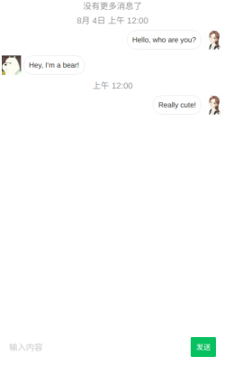

# Vue 聊天组件

这是一个开箱即用的聊天框业务组件，简单、易用，适合做原型开发或二次开发。其特性：

- 不用关心 UI，只需提供业务函数即可
- 支持无限加载

预览效果：



## 快速使用

```vue
<template>
  <div class="container">
    <!-- 组件引入的方式，应提供双方的头像，加载历史消息的方式（函数）和发送消息的方式（函数） -->
    <ChatBox ref="chat" 
      :sourceAvatar="sourceAvatar" :targetAvatar="targetAvatar" 
      :loadHistory="loadHistory" :sendMessage="sendMessage" />
  </div>
</template>

<script>
import ChatBox from '@run27017/vue-chat'
import '@run27017/vue-chat/dist/chat.css'

export default {
  name: 'ChatDemo',
  components: {
    ChatBox
  },
  data () {
    return {
      sourceAvatar: 'https://gitee.com/run27017/assets/raw/master/avatars/girl.jpg',
      targetAvatar: 'https://gitee.com/run27017/assets/raw/master/avatars/bear.jpg'
    }
  },
  methods: {
    // 定义加载历史消息的方式，该函数应该返回一个对象（`{ messages, hasMore }`），或者是返回该对象的 Promise （异步）。
    loadHistory () {
      return { 
        // 消息数据，字段如下，应以时间的倒序给出。
        messages: [
          { text: "Really cute!", time: new Date(2020, 8, 4), direction: 'sent' },
          { text: "Hey, I'm a bear!", time: new Date(2020, 7, 4), direction: 'received' },
          { text: 'Hello, who are you?', time: new Date(2020, 7, 4), direction: 'sent' },
        ], 
        // 定义是否还有历史消息，如果为 false，将停止加载。读者可将其改为 true 演示一下自动滚动更新的效果。
        hasMore: false 
      }
    },

    // 定义发送消息的方式。如果发送成功，应该返回成功发送的消息数据，或者 Promise.
    sendMessage ({ text }) {
      return {
        text,
        time: new Date(),
        direction: 'sent'
      }
    },

    // 该函数演示如何加载新消息（一般通过 WebSocket 实时收取）
    receiveMessage (message) {
      this.$refs.chat.appendNew(message)
    }
  }
}
</script>

<style lang="scss" scoped>
.container {
  height: 600px;
}
</style>
```

## 二次开发

```bash
## 下载源码
$ git clone https://github.com/run27017/vue-chat.git

## 构建库
$ yarn build

## dev serve 模式
$ yarn serve

## 发布到 npm
$ yarn publish --access public
```

## 开源协议

MIT
